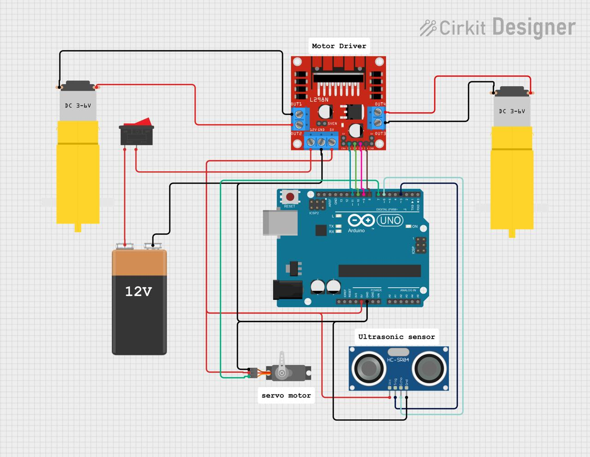

# Autonomous Obstacle-Avoiding Robot

An Arduino-powered 2-wheel robot that drives autonomously and avoids obstacles in real time using an ultrasonic distance sensor mounted on a servo-driven scanner.

## Overview

This project implements real-time decision logic to stop, reverse, and scan left/right on obstacle detection — dynamically selecting the clearer path and turning accordingly without any human input.

## How It Works

1. The robot drives forward continuously while polling the front-facing **HC-SR04 ultrasonic sensor**.
2. If an obstacle is detected within **20 cm**, the robot:
   - Stops
   - Reverses briefly to create clearance
   - Sweeps the servo-mounted sensor **left (180°)** and **right (0°)** to measure distance in both directions
   - Compares the two readings and turns toward the side with more clearance
   - Resumes forward motion
3. This loop repeats continuously, allowing fully autonomous navigation.

## Hardware Used

| Component | Qty | Notes |
|---|---|---|
| Arduino Uno | 1 | Main controller |
| L298N Motor Driver | 1 | Drives both DC motors |
| DC Gear Motors (3–6V) | 2 | Left & right wheels |
| HC-SR04 Ultrasonic Sensor | 1 | Obstacle detection |
| SG90 Servo Motor | 1 | Sweeps the ultrasonic sensor |
| 12V Battery Pack | 1 | Powers motor driver |
| Toggle Switch | 1 | Power on/off |
| Jumper wires, chassis | — | — |

## Circuit Diagram

**Pin Mapping**

| Module | Arduino Pin |
|---|---|
| Servo signal | D7 |
| Ultrasonic Trig | D3 |
| Ultrasonic Echo | D6 |
| Motor T1 (IN1) | D11 |
| Motor T2 (IN2) | D10 |
| Motor T3 (IN3) | D9 |
| Motor T4 (IN4) | D8 |

> Note: The 12V battery powers the L298N motor supply; the Arduino is powered separately (USB or Vin), and grounds are shared across the Arduino, L298N, and sensor.

## Code

The `src/` folder contains three sketches:

- **`AutonomousObstacleAvoidanceRobot.ino`** — the main, final sketch that runs the full obstacle-avoidance behavior.
- **`ServoPosition.ino`** — standalone test to verify servo sweep (0° → 90° → 180°).
- **`DistanceMeasurementSystem.ino`** — standalone test to verify ultrasonic distance readings over Serial.

To run: open `AutonomousObstacleAvoidanceRobot.ino` in the Arduino IDE, select **Arduino Uno** as the board, upload, and power the robot from the 12V battery.

## Demo

Photos and video of the robot in action are in [`media/`](media/).

## Future Improvements

- Add PWM speed control (ENA/ENB) for smoother turns instead of fixed on/off driving
- Add a second (rear) ultrasonic sensor for reverse-direction obstacle detection
- Replace fixed 20 cm threshold with adaptive thresholding based on speed
- Bluetooth/Wi-Fi module for remote monitoring or manual override

## Author

Built by Abiha as a personal Arduino/Embedded Systems project.
